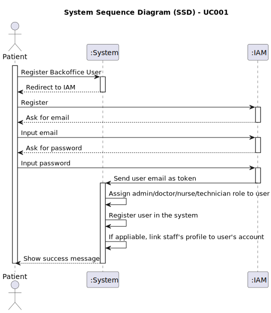

# UC001 - As Admin, I want to register new backoffice users (e.g., doctors, nurses, technicians, admins) via an out-of-band process, so that they can access the backoffice system with appropriate permissions

## 1. Requirements Engineering

### 1.1. Use Case Description

> As Admin, I want to register new backoffice users.

---

### 1.2. Customer Specifications and Clarifications

**From the specifications document:**

- Backoffice users divide themselves into two categories: admins and staff; staff is further divided into doctors, nurses, and technicians, all with a different set of permissions and features.
- Admins are responsible for managing the system and the staff.

**From the client clarifications:**

> **Question:** Can you please clarify if backoffice users registration uses the IAM system? And if the IAM system is the out-of-band process?
> **Answer:** What this means is that backoffice users can not self-register in the system like the patients do. The admin must register the backoffice user. If you are using an external IAM (e.g., Google, Azzure, Linkedin, ...), the backoffice user must first create their account in the IAM provider and then pass the credential info to the admin so that the user account in the system is "linked" with the external identity provider.
>
> **Question:** Can you clarify the username and email requirements?
> **Answer:** The username is the "official" email address of the user. For backoffice users, this is the mechanographic number of the collaborator, e.g., D240003 or N190345, and the DNS domain of the system. For instance, Doctor Manuela Fernandes has email "<D180023@myhospital.com>". The system must allow for an easy configuration of the DNS domain (e.g., environment variable).
For patients, the username is the email address provided in the patient record and used as identity in the external IAM. For instance, patient Carlos Silva has provided his email <csilva98@gmail.com> the first time he entered the hospital. That email address will be his username when he self-registers in the system.
>
> **Question:** There are 2 separate use cases regarding backoffice users: one for the creation of the user account and another one for the creation of the staff's profile. Is there a fixed order for these operations to take place? Does the admin always create the profile first or can he create the user first aswell? If the profile is created first, for example, should the user be created automaticaly or should the admin create the user afterwards, having to do 2 distinct operations?
> **Answer:** Recommended Flow:

  1. Order of operations: The system should support profile first. The admin should then create the user account. The account and user profile are linked by the professional email address or username (depending on the IAM provider).
  2. Distinct Operations: The operations should remain distinct, even if they are performed in quick succession. This ensures that each step (creating user credentials and creating a staff profile) is carefully tracked and managed.
  3. Validation: The system should ensure that a staff profile and user account are both created and linked before the staff member can access the system.
>
> **Question:** One of the Acceptance Criteria of US5.1.1 is "Registered users receive a one-time setup link via email to set their password and activate their account". In previous answers you said "If you are using an external IAM (e.g., Google, Azzure, Linkedin, ...) the backoffice user must first create their account in the IAM provider and then pass the credential info to the admin so that the user account in the system is "linked" with the external identity provider". Can you please clarify this process? Is there a confirmation email? Or, if the backoffice user is already registered in the IAM before being registered in the system, should we forget this AC?
> **Answer:** This requirement (AC from US5.1.1) applies only if you are using an internal IAM. Please consider only the phrasing "Backoffice users are registered by the admin in the IAM through an out-of-band process".

### 1.3. Acceptance Criteria

> AC001.1: Backoffice users (e.g., doctors, nurses, technicians) are registered by an Admin via an internal
process, not via self-registration.
> AC001.2: Admin assigns roles (e.g., Doctor, Nurse, Technician) during the registration process.
> AC001.3: Registered users receive a one-time setup link via email to set their password and activate their
account.
> AC001.4: The system enforces strong password requirements for security.
> AC001.5: A confirmation email is sent to verify the user’s registration.

_Note_: As referenced in section 1.2, the AC001.3 is not applicable if an external IAM system is used.

### 1.4. Found out Dependencies

- This Use Case is relative to US5.1.1, which is related to the backoffice management functionality.
- It relates to the following Use Case(s) as well:
  - [UC006 (US5.1.6)](../../UC006/README.md) - As a (non-authenticated) Backoffice User, I want to log in to the system using my credentials, so that I can access the backoffice features according to my assigned role.
  - [UC012 (US5.1.12)](../../UC012/README.md) - As Admin, I want to create a new staff profile, so that I can add them to the hospital’s roster.

### 1.5 Input and Output Data

**Input Data:**

- Typed data: username/email
- Selected data: user's role (i.e.: Admin, Doctor, Nurse, Technician)

**Output Data:**

- (In)sucess message

### 1.6. System Sequence Diagram (SSD)

### 1.7 Other Relevant Remarks

- An IAM system must be chosen and integrated with the system.
