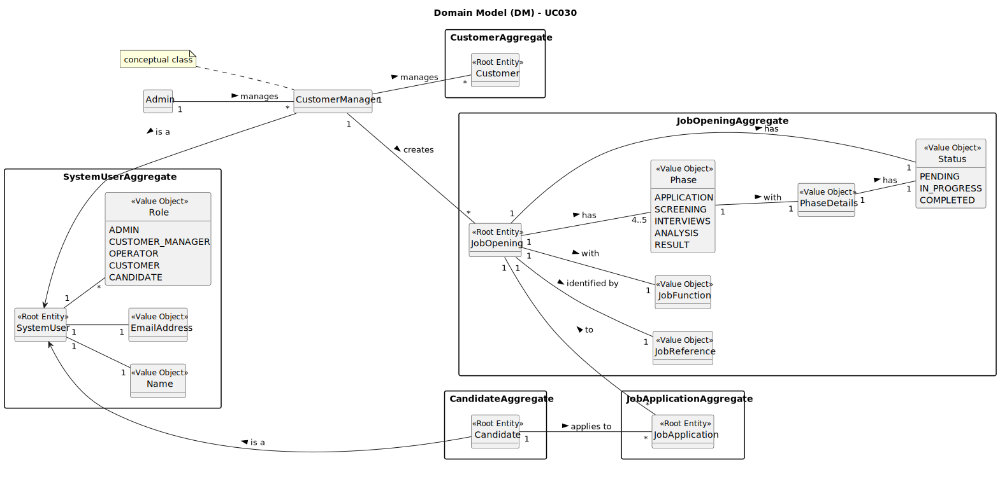

# UC017 - As Doctor, I want to update an operation requisition, so that the Patient has access to the necessary healthcare

## 2. Analysis

### 2.1. Relevant Domain Model Excerpt

The following diagram was created based on the EAPLI framework, adapted for this user story:

### 2.2. Process Specification

#### 2.2.1. Normal Flow
1. **Authenticate Doctor**: Verify that the user is logged in as a Doctor with appropriate permissions.
2. **Access Operation Requests Interface**: The Doctor navigates to the operation requests management section of the system.
3. **Select Operation Request**: The Doctor chooses the specific operation request they want to update.
4. **Update Operation Request**: The Doctor can update different aspects of the request, such as the operation type, the suggested deadline, or the priority.
    - **Operation Type**: The Doctor selects a new operation type from a list of those related to their role.
    - **Suggested Deadline**: The Doctor inputs a new suggested deadline for the operation.
    - **Priority**: The Doctor changes the priority level of the operation.
5. **Log Changes**: The system logs all updates made to the operation request.
6. **Notify Planning Module**: Once the update is made, the system notifies the Planning Module of the change.
7. **Feedback**: The system provides feedback to the Doctor on the success or failure of the update operation.

#### 2.2.2. Exceptional Flows
- **EF017.1**: If the system cannot find the operation request, it must notify the Doctor and log the error.
- **EF017.2**: If the update cannot be processed, the system must notify the Doctor and log the error.

### 2.3. Functional Requirements Reevaluation
- **FR017.1**: The system shall allow doctors to update the operation requests they created.
- **FR017.2**: The system shall ensure only the requesting doctor can update the operation request.
- **FR017.3**: The system shall log all updates to the operation request.
- **FR017.4**: The system shall notify the Planning Module of any updates.

### 2.4. Non-functional Requirements Specification
- **Security**: The system must ensure that only the requesting doctor can access and modify their own operation requests.
- **Performance**: Updates to operation requests should be processed and reflected in the system immediately.
- **Usability**: The interface must clearly present the options for updating the operation request and provide feedback on the success or failure of the update.

### 2.5. Data Integrity and Security
- The system must ensure the accuracy of all data related to operation request updates and protect the integrity of this data.
- Security measures should prevent unauthorized access to operation request updates.

### 2.6. Interface Design
- The interface will follow the EAPLI framework's design patterns, providing a user-friendly experience for the Doctor.
- The interface should guide the Doctor through selecting and updating an operation request, with options clearly displayed and success/failure feedback provided.

### 2.7. Risk Analysis
- **R017.1**: Unauthorized Access to Operation Requests
    - **Mitigation**: Implement access control to ensure only the requesting doctor can update the operation request.
- **R017.2**: System Error During Update
    - **Mitigation**: Implement error handling mechanisms to notify the Doctor of any system failures and provide guidance on how to proceed.

### 2.8. Decisions
- **D017.1**: Use role-based access control for operation request updates, restricting access to the requesting doctor only.
- **D017.2**: Use the system's logging functionality to record all changes made to operation requests.
- **D017.3**: Notify the Planning Module of any updates to operation requests.
- **D017.4**: Use the provided domain model as a reference for implementing the operation request update functionality.
