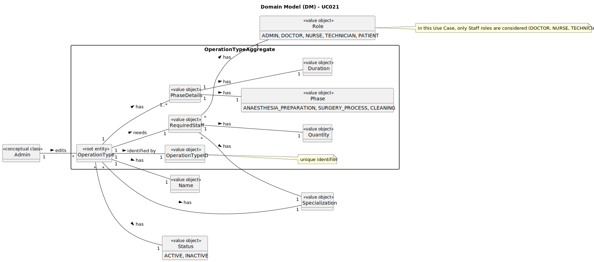

# UC021 - As an Admin, I want to edit existing operation types, so that I can update or correct information about the procedure

## 2. Analysis

### 2.1. Relevant Domain Model Excerpt

### 2.2. Process Specification

#### 2.2.1. Normal Flow

1. **Preconditions**: The Admin is logged in and has access to the backoffice management functionality.
2. **Select Option**: The Admin chooses to edit an existing type of operation.
3. **Enter Operation Type Details**: The Admin enters the operation's new name, estimated duration (for each phase - anaesthesia/preparation, surgery and cleaning), specialization and required staff.
4. **Validate Operation Name**: The system checks if the operation name is unique.
5. **Save Operation Type**: The system saves the edited operation type in the database with the same ID, replacing the previous information.
6. **Log Creation**: The system logs the edit of the operation type.
7. **Make Operation Type Available**: The system makes the operation type available for scheduling immediately.

#### 2.2.2. Exceptional Flows

- **EF021.1**: If the operation name is not unique, the system must notify the Admin and request a different name.
- **EF021.2**: If the operation type cannot be saved, the system must notify the Admin and log the error.

### 2.3. Functional Requirements Reevaluation

- **FR021.1**: The system shall allow the Admin to edit existing types of operations, providing the operation name, estimated duration (for each phase), specialization and required staff (role, specialization and quantity).

### 2.4. Non-functional Requirements Specification

- **Functionality**: The system shall allow the Admin to edit existing operation types, providing a clear workflow for updating operation information.
- **Usability**: The interface should be intuitive, guiding the Admin smoothly through the operation type creation process with clear instructions and error handling.
- **Reliability**: The system shall validate the operation name to ensure uniqueness and provide feedback on the success or failure of the operation type editing process.
- **Performance**: The operation type editing process should complete within acceptable time limits to maintain system responsiveness.
- **Supportability**: The system shall log the edit of operation types for audit purposes and make them available for scheduling immediately.

### 2.5. Data Integrity and Security

- Data integrity measures should ensure that operation types are accurately recorded and reflected in the system without compromising data consistency.
- Security measures should prevent unauthorized access to operation type editing functionality and protect sensitive operation data.
- The system should validate the operation name to ensure that it is unique and prevent duplicate entries.

### 2.6. Interface Design

- The interface shall be user-friendly, providing a clear workflow for editing operation types with input fields for operation name, estimated duration (for each phase - in sequential order), specialization and required staff (role, specialization and quantity).

### 2.7. Risk Analysis

- **R021.1**: Duplicate Operation Name
  - **Mitigation**: Implement a validation mechanism to check for duplicate operation names and notify the Admin to provide a unique name.
- **R021.2**: Database Error During Operation Type Editing
  - **Mitigation**: Implement error handling mechanisms to log the error and notify the Admin of the issue.
- **R021.3**: Unauthorized Access to Operation Type Editing
  - **Mitigation**: Implement secure access control mechanisms to restrict operation type editing to authorized Admin users.

### 2.8. Decisions

- **D021.1**: Use a validation mechanism to ensure the uniqueness of operation names during editing.
- **D021.2**: Implement error handling to log and notify the Admin of any issues during operation type editing.
- **D021.3**: Utilize secure access control mechanisms (with the help of the IAM) to prevent unauthorized access to operation type editing functionality.
- **D021.4**: Log the editing of new operation types for audit purposes and immediate availability for scheduling.
